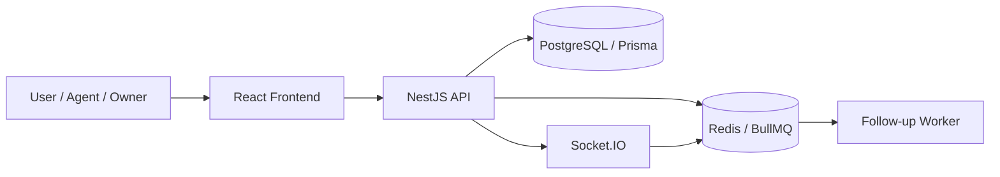
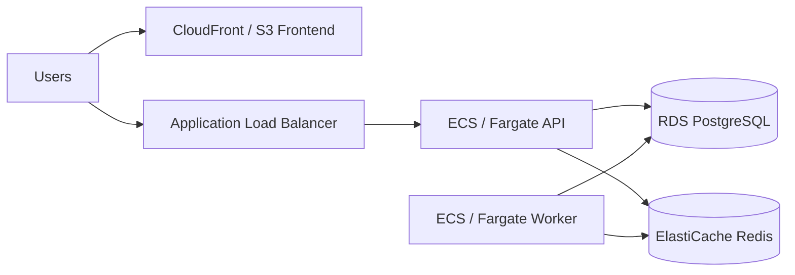

# Architecture Diagram

Leadflow is split into a React frontend, NestJS API, PostgreSQL database, Redis services, and a standalone BullMQ worker.

## Local Deployment

## AWS Deployment

PostgreSQL is the system of record. Redis handles BullMQ state and Socket.IO adapter coordination. Tenant and role checks are enforced by the API before database reads or mutations.
